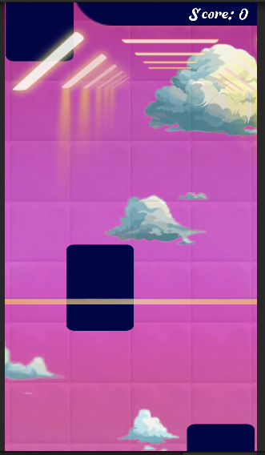
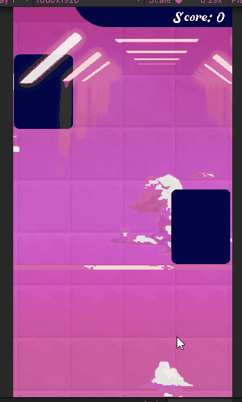

# Magic Tiles 3 Clone

This is a Unity-based implementation of a simplified version of Magic Tiles 3 game, featuring falling tiles synchronized with background music, scoring system, and interactive gameplay mechanics.



## Table of Contents

- [Features](#features)
- [Setup Instructions](#setup-instructions)
- [Testing the Project](#testing--gameplay)
- [Packages in Use](#packages-in-use)

## Features
- **Rhythm-Based Gameplay:** Tiles fall in sync with background music
- **Interactive Controls:** Tap on falling tiles to score points
- **Scoring System:** Points awarded based on accuracy and timing of tile taps
- **Visual Feedback:** Particle effects and animations for successful tile taps
- **Dynamic Background:** Engaging visual experience with animated background

## Setup Instructions

Below are the steps to successfully run the project on your local machine

### 1. Clone the Repository

```bash
git clone https://github.com/sonnguyen9800/TestAmanotes.git
cd TestAmanotes
```

### 2. Install Unity

Ensure you have [Unity](https://unity.com/) installed. This project was developed using Unity version 2021.3 LTS.

### 3. Open the Project in Unity

- Launch **Unity Hub**
- Click on the **"Add"** button, then select **Add Project from Disk**
- Navigate to the cloned project directory and select it
- Unity will load the project; this may take a few moments


## Testing & Gameplay

### A. Running the Game

1. Open the main game scene in Unity Editor
2. Click the **Play** button to start the game
3. Use mouse clicks or touch input to tap on falling tiles
4. Try to match the rhythm of the background music for better scores

### B. Game Features

#### Scoring System
- Points are awarded based on:
  - Accuracy of tile taps
  - Speed of response

#### Visual Feedback
- Text effect shows up to visualize your success. Your taps can be *perfect*, *great* or *good*
- Tiles will change color to dark when tapped on.
- Backgrounds with moving sprites for dreamy experience

### C. Game Showcase
Below are a gif to illustrate how gameplay takes place:



## Third Party Assets

- Debussy : Clair De lune (*MIDI* and .*ogg*)
- Font: Musicals by Brain Eaters Font Co, link: https://www.dafont.com/musicals.font
- Musician by Mocha Frappuccino, link: https://www.dafont.com/musician.font
- SFX is collected in sample of LMMS software

## Packages In Use
- **Unity 2021.3 LTS** - Unity Game Engine
- **TextMeshPro** - Advanced text rendering for UI elements
- **Dotween** - For background music and sound effects
- **Fingers** - For gesture detection
- **Melanchall.DryWetMidi** to process MIDI format. Link: https://github.com/melanchall/drywetmidi
- **Nightpool** for object pooling. Link: https://github.com/MeeXaSiK/NightPool
- **SisyphusFramework**: Custom framework. Link https://github.com/sonnguyen9800/Sisyphus-UniFramework
  
## Platform Support
- The project is ensured to run on Unity Editor. Android or PC build is **not** tested!
- The project is created in **Window 10**. Running on Mac may require some re-configuration. I don't have a *Mac* so I couldn't test properly.